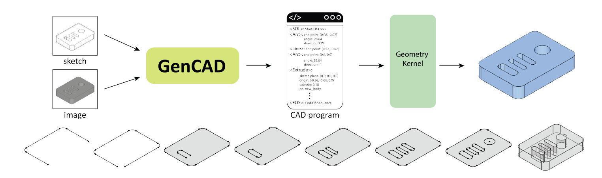
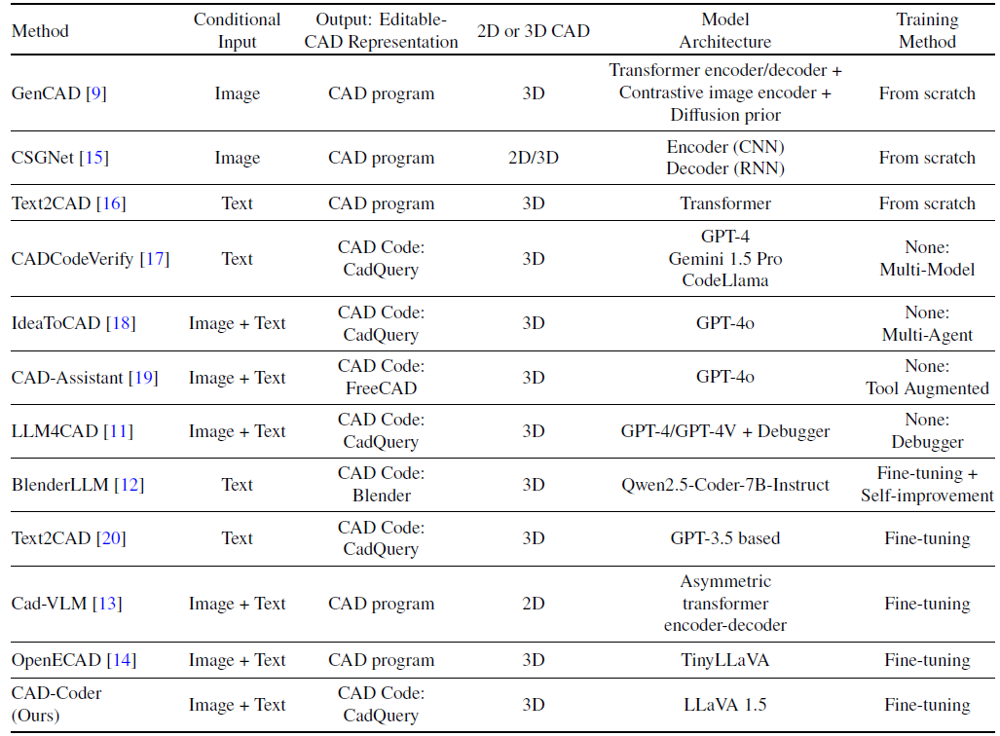

# CADQuery Code Generation - GenCAD Challenge Submission

## The Task
Create the best CadQuery code generator model.

### Challenge Steps:
1. Load the dataset (147K pairs of Images/CadQuery code).
2. Create a baseline model and evaluate it with the given metrics.
3. Enhance the baseline model by any means and evaluate again.
4. Explain your choices and potential bottlenecks.
5. Show what enhancements you would have done with more time.

> Creativity and methodology matter more than absolute results!

---

## Step 1: Literature-Informed Design

After reviewing recent works and their approaches (see the table below), the following insights informed our methodology:

### Notable References:
- GenCAD & CSGNet use custom architectures trained from scratch
- CAD-Coder (LLaVA 1.5) fine-tunes vision-language models
- LLM4CAD, CAD-Assistant rely on GPT-4(o) with tool augmentation

Our goal: develop a **practical**, **open**, and **extensible** solution that aligns with CadQuery’s structure, and is trainable on commodity GPUs.

Source: Doris, A. C., Alam, M. F., Nobari, A. H., & Ahmed, F. (2025, May 20). CAD-Coder: An Open-Source Vision-Language model for Computer-Aided design code generation. [arXiv:2505.14646](https://arxiv.org/abs/2505.14646)

---

##  Step 2: Baseline Model - Vision Encoder + GPT-2

We developed a simple, extensible baseline based on:

-  **Visual Encoder**: Pretrained ResNet18 for grayscale CAD image embeddings
-  **Language Decoder**: GPT-2 (gpt2) autoregressive transformer
-  **Fusion**: Visual embeddings projected to token space and prepended

### Limitations
- GPT-2 struggles with indentation-sensitive Python code
- Frequent CadQuery syntax errors
- Lacks code-specific pretraining

---

##  Step 3: Enhancement with Salesforce CodeGen

### Why `Salesforce/codegen-350M-mono`?
-  **Tailored for code generation** (unlike GPT-2)
-  **Monolingual Python** model (perfect for CadQuery DSL)
-  **Better results on syntax-aware metrics** (e.g., VSR, IoU)
-  **Lightweight & fine-tunable** on a single GPU
-  **Compatible with self-debugging loops** to repair code

This resulted in higher Valid Syntax Rates and improved geometric alignment.

---

##  Step 4: Bottlenecks and Observations

### Bottlenecks:
- Lack of Structural Abstraction: The model treats code as flat text, without leveraging part-level or hierarchical CAD semantics.
- No Runtime Feedback Loop: Code is generated without execution-aware correction, leading to compounding syntax errors.
- Weak Vision-Language Fusion: Visual features are encoded once and not referenced during decoding, limiting fine-grained alignment.
- Missing Spatial and Geometric Priors: The model struggles to enforce symmetry or layout constraints common in CAD design.
- Prompt and Memory Limitations: Prompting is static and lacks adaptive tuning or reuse of geometry patterns across samples.

---

##  Step 5: Future Enhancements 

- Grammar-Aware Decoding: Introduce syntax-constrained generation or AST-based decoding to reduce invalid CadQuery outputs and better handle indentation-sensitive Python code.

- Cross-Attention Fusion: Replace simple visual prepending with a vision–language transformer using cross-attention for more contextual alignment between image features and code tokens.

- Reinforcement from Execution Feedback: Use mesh-based evaluations (e.g., IoU) as reward signals in fine-tuning to optimize geometry-level accuracy rather than only token-level loss.

- Multi-Step Self-Correction: Enable iterative refinement loops where the model diagnoses and repairs its own output using additional prompts.

- Curriculum Training: Start with simple primitives and progressively move to complex multi-sketch parts to improve learning stability and accuracy.

---

##  Conclusion
This project demonstrates a full training loop, from baseline GPT-2 to CodeGen-based enhancement. While absolute metrics remain improvable, the architecture choices and pipeline provide a solid foundation for real-world CAD code generation.

